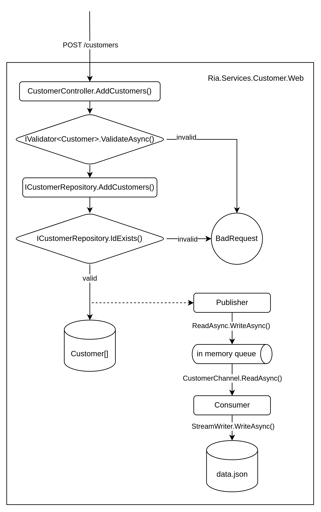

## Introduction

This repository contains three applications developed using C#/.NET as part of a code assessment for RIA Money Transfer:

- A console application that calculates payment denominations and their possible combinations.
- A Web API that enables clients to add and retrieve customers with required validations.
- An API Client that consumes the aforementioned API to simulate POST requests based on specific requirements

[The requirements for the programs in this repository can be found at this link.](https://docs.google.com/document/d/1uxOVrUi6g3qwTDAe8uAFMlJWVMhQDwXg/edit?usp=sharing&ouid=117061835670392908130&rtpof=true&sd=true)


## Denomination routine (console application)

The program attempts to pay out the amounts using the highest denomination available.
Once there is no more space for the highest denomination, it recursively fills the
remaining value with the next smaller denomination. This process continues until the amount is paid.

After the initial attempt, the program tries to remove one unit of the current
denomination to explore other combinations. For example, if it was possible to
use 2 units of 100 euros, 1 of 50 euros, and 1 of 10 euros initially, the program then
tries 1 unit of 100 euros, 3 of 50 euros, and 1 of 10 euros, and so on. It employs a
sliding window approach to include smaller denominations as well.

For instance, for 260 euros:

1. 2 x 100 + 1 x 50 + 1 x 10
2. 1 x 100 + 3 x 50 + 1 x 10
3. 1 x 100 + 2 x 50 + 6 x 10
4. 1 x 100 + 1 x 50 + 11 x 10
5. 1 x 100 + 0 x 50 + 16 x 10
6. 0 x 100 + 4 x 50 + 6 x 10
7. 0 x 100 + 3 x 50 + 11 x 10
8. 0 x 100 + 2 x 50 + 16 x 10
9. 0 x 100 + 1 x 50 + 21 x 10
10. 0 x 100 + 0 x 50 + 26 x 10

This process continues until the highest denominations are used as much as possible.

The program includes a unit test to validate a scenario for 210 euros.

### How to run

To build the Docker image, navigate to the root of the repository and run:

```shell
docker build --file ./Payment.Denomination.Dockerfile . -t payment_denomination
```

Then, to run the application, execute the following command:

```shell
docker run payment_denomination
```

## Customer API (Web API)

The API follows a clean architecture approach, avoiding the creation of multiple .NET projects to keep it simple.
Instead, classes are used to separate the controller, repository, and domain. In larger projects, an application
layer could be beneficial to manage part of the business logic.

Considerations for the project include:

1. Request validation is performed within the API layer (controller) (CustomerValidator.cs) and the infrastructure
layer (repository).
2. To validate existing customer IDs, a HashSet is utilized to store unique IDs. Upon saving a customer to the array,
its ID is added to the set.
3. The domain (Customer.cs) includes logic for comparison operators, enhancing cleanliness when inserting new customers.
4. Data persistence is achieved by storing data in a JSON file (data.json) within the application. Asynchronously, a
consumer (CustomerConsumer.cs) listens to a channel (queue) every 500 milliseconds to save the array to the JSON file.
Data is published (CustomerPublisher.cs) to the queue whenever a POST request is made and customers are added to the array.
5. The repository (CustomerRepository.cs) attempts to load data from the JSON file before starting the application.
6. To store new customers in a sorted manner, each new customer is iterated over individually and inserted into the array.
Initially, sorting all new customers and inserting them into the array at once was considered but proved to be inefficient.



### How to run

To build the Docker image, navigate to the root of the repository and run:

```shell
docker build --file ./Customer.Web.Dockerfile . -t customer_web
```

Then, to run the application, execute the following command:

```shell
docker run customer_web
```

To access the container's address, first find its ID by running:

```shell
docker ps -la
```

Then, check its IP address using the following command, replacing <CONTAINER_ID> with the actual ID:

```shell
docker inspect <CONTAINER_ID> | grep "IPAddress"
```

Once you have the IP address, you can access the Swagger UI at the path `/swagger/index.html`.

Later, you will discover how to run both the API and the client simultaneously using Docker Compose.

## Customer Client (console application)

The client is implemented as a console application with preset inputs and randomly generated requests
sent to the API.

It generates random requests, ranging from 4 to 10 requests, each containing 2 to 8 customers within
the payload. These requests are sent asynchronously in parallel, with a random wait time between 100
and 5000 milliseconds before sending the next request.

To ensure that each customer is assigned a sequentially increasing ID, a lock mechanism is used to
access the current ID.

### How to run

To build the Docker image, navigate to the root of the repository and run:

```shell
docker build --file ./Customer.Client.Dockerfile . -t customer_client
```

Then, to run the application, execute the following command:

```shell
docker run customer_client
```

# Running client and server

> Note: Multiple containers may share the same volume for the same image.
> Even if you terminate and delete them, starting a new container will
> share and retain the same data as the previous one.
> 
> This is important to consider when running the client from scratch, as
> it will start sending new requests with a starting ID from 0. However,
> the API may already have IDs from previous calls, potentially leading to
> inconsistencies.
> 
> To prevent this issue, ensure that you delete both the container and
> its attached volume when you are finished using them.

To run both the client and the server simultaneously, use Docker Compose to
build the images. Navigate to the root of the repository and execute the
following commands:

```shell
docker compose build --no-cache
```

Then the following command to run the containers which will communicate to
each other.

```shell
docker compose up
```

# Others

- I would add more unit tests to improve test coverage, particularly focusing
- on domain validation.
- Considering a larger project, I would split it into multiple .NET projects
(`.csproj`) to separate concerns and responsibilities. This would accommodate
more complex domains and additional infrastructure components, such as external
databases, caches, and queues.
- I would refactor the API to asynchronously write new customers internally,
similar to the current json file write operation.
- Additionally, I would modify the write operation to save new customers to a
CSV file by appending them. While the data wouldn't be sorted in the CSV, it
would be sorted upon application startup by running some sort algorithm only
once, then loading the sorted data into the internal array. This approach would
improve the speed of the write operation to the in-memory data and ensure
that the data is persisted and later retrieved in a sorted manner.

You can execute the following command at the root of the repository to run
the unit tests:

```shell
dotnet test
```
